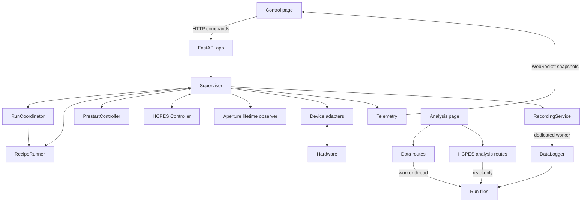

# Runtime architecture

One Python process owns one reactor. `python -m reactor` validates the hardware
map, creates the FastAPI application, and uses its lifespan to connect and stop
the Supervisor. Run one Uvicorn worker: multiple workers would each construct a
Supervisor and compete for the same DAQ modules and serial ports.

## Ownership and dependencies

- `dependencies.py` supplies device factories and per-instance `StatePaths`.
  Production and VirtualReactor share Supervisor startup/shutdown; tests can
  disable background polling while retaining the same connection lifecycle.
- `supervisor.py` owns connections, live readings, valve commands, fill
  commands and physical run cleanup. Its public command methods remain
  the application hardware boundary.
- `control/recipe_model.py` defines the schema and pure ALD/CVD builders.
  `control/recipe.py` executes them and maintains exposure/cycle clocks; it
  re-exports the schema/builders for existing imports.
- `control/clock.py` supplies named elapsed and wall-clock callables. Supervisor
  injects one `Clock` into the coordinator, recipe runner, pre-start controller,
  HCPES controller and aperture-lifetime observer.
  VirtualReactor accepts a clock for deterministic duration and timestamp tests.
- `control/contracts.py` describes the capabilities controllers consume. They
  query public run admission and report events without accessing private locks.
- `control/fill.py` owns fill regulation; `control/sweep.py` owns valve
  identification. Supervisor delegates progress and commands. Sweep stop/shutdown
  bounds each release and task-settlement attempt and cancels after a grace
  period. It may return while an uncooperative adapter is still unwinding, with
  device cleanup unresolved until that task finishes. Unfinished sweep and
  release tasks retain ownership, so a new sweep cannot overlap late I/O.
  Failed or timed-out releases report an unconfirmed output state instead of
  claiming the lines are low.
- `control/prestart_model.py` owns the versioned recipe schema, device/action
  capability catalog, parameter resolution and pure preview generation.
  `control/prestart_store.py` owns the server-side library, atomic replacement
  and optimistic revision checks. `control/prestart.py` snapshots one resolved
  start/abort sequence, owns its task and progress, and calls Supervisor public
  methods for every hardware action. Stop hands over primed; abort runs the
  snapshotted recipe cleanup. The protected Current recipe retains the prior
  Ar/fill/relay/HV/DC-supply behavior.
- `control/hcpes_model.py` owns the versioned characterization plan, typed
  parameter axes, lazy Cartesian expansion, duration estimates and polarity
  compatibility signature. `control/hcpes_store.py` owns the revisioned plan
  library and linked-polarity campaign state. `control/hcpes.py` owns one
  resolved acquisition, including its restricted startup, stability gates,
  bounded recovery and cleanup. It reaches hardware only through public
  Supervisor methods and holds exclusive admission against recipes, pre-start,
  fill regulation, valve identification and manual writes to owned controls.
- `telemetry.py` builds independent snapshots and manages bounded subscriber
  queues. A later reading cannot mutate an already published frame. Each slow
  viewer retains at most four frames; older frames are dropped.
- Live recording callers use explicit lifecycle/sample/capture methods and
  read metadata from RecordingService snapshots. Generic dispatch remains a
  compatibility seam for isolated tests.
- `recording.py` serializes recording operations on its own single worker.
  `datalog.py` owns file formats/handles, while `run_report.py` formats the plain
  text parameter report. Callers in the live application use RecordingService;
  direct DataLogger calls are intended for isolated synchronous format tests.
- `hcpes_recording.py` owns immutable characterization bundles and linked
  campaign derivation. Raw and qualified JSON Lines retain full snapshots;
  compact point CSV rows carry core trends; nested point-channel JSON Lines
  carry statistics for every numeric qualified channel. Plain-text run summary,
  concise timeline CSV and multi-document point YAML are derived from the same
  ordered records for direct operator inspection. Device-facing setpoints and
  explicitly named machine columns retain A; operator-facing current controls,
  readable YAML, plots and hover text use mA.
- `aperture_lifetime.py` integrates already-observed Glassman/relay state on a
  monotonic clock and atomically owns replacement history. It performs no
  hardware reads or writes.
- `server/data.py` owns file discovery, containment checks, merge orchestration
  and analysis HTTP routes. It receives a directory, never a Supervisor.
  `analysis/ellipsometer_merge.py` remains pure text/number processing.
- `server/hcpes_analysis.py` separately validates and reads HCPES bundles for
  the Analysis page. It has no Supervisor/device dependency and cross-checks
  campaign claims against both immutable source manifests before presenting a
  linked negative-to-positive series.

## Polling and experiment timing

Three asyncio tasks poll at separate rates: DAQ/supplies at `loop_hz` 2 Hz,
current/telemetry at `current_hz` 5 Hz, and MFCs at `mfc_hz` 6 Hz by default.
Blocking instrument calls use worker threads and device locks. MFC reads cannot
hold up the current loop. Recipes and pre-start execute on the event loop.

`Clock.elapsed` is monotonic and drives exposure credit, holds, deadlines,
cycle progress and ETA. `Clock.wall` supplies epoch timestamps for events,
telemetry and run metadata. DataLogger retains its own wall-clock origins for
manual logs and their filenames. The run CSV's
`elapsed_s` column retains its historical wall-clock subtraction
(`sample["t"] - run_started_at`) for file-format compatibility; it is not the
time source for control decisions and can reflect a system-clock adjustment.

The live snapshot carries the last known value. Run exports use read-sequence
counters to leave a channel blank unless it was measured since the previous
row. Samples and recipe progress are copied before crossing to the recording
worker, so a later tick cannot change a queued row.

Recording samples use a bounded backlog (2,048 pending jobs by default). When
full, further samples are rejected and a recording error is latched in status
and history; control continues. The header promotes it only while the owning
recording stream is active, then clears while the event/error logs retain it.
Lifecycle operations are ordered behind accepted writes.
Stopping a run performs hardware cleanup before waiting for its recording to
close. Server shutdown gives recording close a five-second deadline and reports
timeout or latched recording errors in its receipt. A released device port does
not prove that queued files were flushed. Accepted worker jobs retain ownership
after caller cancellation; the process exit deadline can still interrupt a hung
filesystem operation.

Generic analysis file reads, merging and saving run in a worker, separate from the
recording executor. This removes synchronous analysis work from the control
event loop, but it is not a hard real-time guarantee: CPU work still shares the
Python process, and small settings writes remain synchronous. HCPES analysis is
read-only and parses bounded session/campaign files in FastAPI's synchronous
endpoint worker pool. Per-run event and
error files use the recording worker; recording-error events are not submitted
back to that failing writer. Hard physical deadlines require measured end-to-end timing and
suitable hardware, such as supported hardware-clocked DAQ output or a PLC;
deployment measurements remain separate from fake-device acceptance in Beads.

## Run admission and recording failures

`control/run_coordinator.py` owns normal-run admission, cancellation and an
immutable `RunSession` containing selected valve IDs and cleanup policy.
`idle`/`finished` → `preparing` → `executing` → `finishing` → `finished` is the
normal lifecycle. A cancelled preparation restores prior metadata and finishes
without executing a recipe. Pause/reignition remain runner phases within an
executing session. `in_progress` also observes the runner task, keeping admission
closed through its final unwind. Pre-start phases remain separate.

All run starts share the coordinator lock. A running recipe or pre-start is checked before
changing run metadata or opening another export. Recording is prepared before
starting recipe execution. Abort/shutdown can cancel a start waiting on file
preparation, without starting the recipe or advancing the remembered run name.
Live edits share an edit lock with run completion. They preserve the admitted
hardware identities and append change history using elapsed time; a supplied
`_run_started_at` rejects edits from a different run.

HCPES has a separate controller task but uses the same Supervisor admission
boundary. Ownership begins before recording preparation and remains through
physical cleanup and recording close. A cancelled or failed recording open
cannot orphan ownership. Manual commands to its MFCs, four support supplies or
relay are refused while it runs; unrelated background-MFC control is also
refused because every configured MFC is either an explicit axis or locked zero.

Recording errors (open, header/row write, flush, close, or backlog overflow)
appear in `logging.errors` and the event log. The control-page header promotes
one only while the owner of that exact recording stream remains active.
Repeated identical errors are deduplicated. Errors remain visible for the server
session in logging state/history because later successful writes do not repair
missing experiment data.
Recording failure does not add an automatic hardware action or stop a run.

## Browser and persistence

There is no frontend build step. `index.html` loads `control.css` and the ES
module `control.js`; `live-charts.js` owns plotting and chart interaction through
an explicit `createLiveCharts` interface, while `hcpes-editor.js` owns the
Diagnostics characterization builder/monitor. `analysis.html` loads
`analysis.css`, `analysis.js`, reusable `analysis-plot.js`, and the isolated
`hcpes-analysis.js` tab. The latter presents current in mA and defines
acquisition order as condition-completion sequence; its hover supplies every
commanded setpoint plus outcome/provenance.
`control-transport.js` owns HTTP/WebSocket lifecycle,
`control-run-forms.js` owns parameter persistence/modes, and
`control-device-panels.js` owns supply/MFC/valve rendering and commands;
`aperture-card.js` owns the maintenance-history card. Cached
page navigation suspends/resumes transport; final unload disposes handlers.
Static assets revalidate on reload.

Hardware mapping is YAML. Labels, last-commanded valve state, last-started run
name, shared run parameters, the pre-start recipe library, the HCPES plan and
campaign library, and the shared generic-analysis layout are JSON. All state
paths, including the process registry, are supplied through `StatePaths`.
Machine-local maintenance state uses that boundary too:
`config/aperture_lifetime.json` is a versioned atomic record of observed HCPES
beam time and replacement history. Its owner consumes already-polled Glassman
status plus last-commanded relay state; it never polls or commands hardware.
The supervisor projects its current total into sampled telemetry as
`aperture_lifetime_s`; normal run exports and HCPES raw/qualified and point
records consume that same derived value without another hardware read.
Browser localStorage caches parameters
and stores display preferences. Generic experiment records are CSV/text under
`data/<run>/`; HCPES session/campaign directories are immutable bundles directly
under the configured data directory. Beads' Dolt database tracks development work, not reactor state.
Valve state is commanded state, not measured position, and restoring it never
writes a hardware output.

The server binds to `0.0.0.0` by default. `REACTOR_PASSWORD` enables Basic auth
for pages, API and WebSocket; `--host 127.0.0.1` binds locally. The control page
uses `wss:` when served over HTTPS. See CONTROL_MODEL.md for the exact, explicitly
requested automatic actions and lifecycle behavior.

## Validation

Run `python -m reactor.testing.validate full --require-node` for the complete
Python and browser-module regression suite, or `python -m tests.run_all` for
Python only. The Node harnesses under `tests/js/` cover live charts, bootstrap,
transport/forms/device modules, pre-start and HCPES editors, HCPES analysis,
generic analysis plots and the aperture card. Node is optional at runtime.
These checks use fake hardware and do not validate physical hardware or browser
appearance.

Typed input models in `control/parameters.py` preserve the original raw payload
for settings/reports. Run inputs normalize once before building a recipe.
Pre-start normalizes each stage when it is reached: moving a failing conversion
earlier can change which existing commands precede cleanup.
