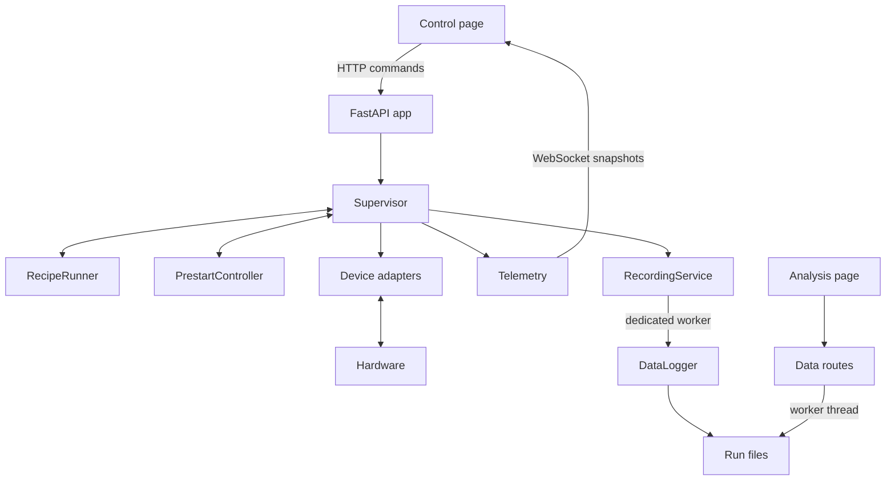

# Runtime architecture

One Python process owns one reactor. `python -m reactor` validates the hardware
map, creates the FastAPI application, and uses its lifespan to connect and stop
the Supervisor. Run one Uvicorn worker: multiple workers would each construct a
Supervisor and compete for the same DAQ modules and serial ports.

## Ownership and dependencies

- `supervisor.py` owns connections, live readings, valve commands, fill
  regulation, run admission and run cleanup. Its public command methods remain
  the application hardware boundary.
- `control/recipe_model.py` defines the schema and pure ALD/CVD builders.
  `control/recipe.py` executes them and maintains exposure/cycle clocks; it
  re-exports the schema/builders for existing imports.
- `control/prestart.py` owns pre-start's task, parameters and progress. It calls
  Supervisor methods for every hardware action. Stop hands over primed; abort
  runs the previously specified Ar/fill/relay/HV/DC-supply cleanup.
- `telemetry.py` builds independent snapshots and manages bounded subscriber
  queues. A later reading cannot mutate an already published frame. Each slow
  viewer retains at most four frames; older frames are dropped.
- `recording.py` serializes recording operations on its own single worker.
  `datalog.py` owns file formats/handles, while `run_report.py` formats the plain
  text parameter report. Callers in the live application use RecordingService;
  direct DataLogger calls are intended for isolated synchronous format tests.
- `server/data.py` owns file discovery, containment checks, merge orchestration
  and analysis HTTP routes. It receives a directory, never a Supervisor.
  `analysis/ellipsometer_merge.py` remains pure text/number processing.

## Polling and experiment timing

Three asyncio tasks poll at separate rates: DAQ/supplies at `loop_hz` 2 Hz,
current/telemetry at `current_hz` 5 Hz, and MFCs at `mfc_hz` 6 Hz by default.
Blocking instrument calls use worker threads and device locks. MFC reads cannot
hold up the current loop. Recipes and pre-start execute on the event loop.

The live snapshot carries the last known value. Run exports use read-sequence
counters to leave a channel blank unless it was measured since the previous
row. Samples and recipe progress are copied before crossing to the recording
worker, so a later tick cannot change a queued row.

Recording samples use a bounded backlog (2,048 pending jobs by default). When
full, further samples are rejected and a persistent recording error is shown;
control continues. Lifecycle operations are ordered behind accepted writes.
Stopping a run performs hardware cleanup before waiting for its recording to
close. Server shutdown drains accepted file work and shuts down the worker.
A hung filesystem can still delay file completion/shutdown, but it does not
block the event loop while the worker is waiting.

Analysis file reads, merging and saving run in a worker, separate from the
recording executor. This removes synchronous analysis work from the control
event loop, but it is not a hard real-time guarantee: CPU work still shares the
Python process, and small settings writes and application event logging remain
synchronous. Hardware-timed DAQ output is required for hard timing guarantees.

## Run admission and recording failures

All run starts share a lock. A running recipe or pre-start is checked before
changing run metadata or opening another export. Recording is prepared before
starting recipe execution. Abort/shutdown can cancel a start waiting on file
preparation, without starting the recipe or advancing the remembered run name.

Recording errors (open, header/row write, flush, close, or backlog overflow)
appear in `logging.errors`, the event log, and the control page's alert chip.
Repeated identical errors are deduplicated. Errors remain visible for the server
session because later successful writes do not repair missing experiment data.
Recording failure does not add an automatic hardware action or stop a run.

## Browser and persistence

There is no frontend build step. `index.html` loads `control.css` and the ES
module `control.js`; `live-charts.js` owns plotting and chart interaction through
an explicit `createLiveCharts` interface. `analysis.html` loads `analysis.css`
and `analysis.js`. Static assets revalidate on reload.

Hardware mapping is YAML. Labels, last-commanded valve state, last-started run
name, and shared run parameters are JSON. Browser localStorage caches parameters
and stores display preferences. Experimental records are CSV/text under
`data/<run>/`. Beads' Dolt database tracks development work, not reactor state.
Valve state is commanded state, not measured position, and restoring it never
writes a hardware output.

The server binds to `0.0.0.0` by default. `REACTOR_PASSWORD` enables Basic auth
for pages, API and WebSocket; `--host 127.0.0.1` binds locally. The control page
uses `wss:` when served over HTTPS. See CONTROL_MODEL.md for the exact, explicitly
requested automatic actions and lifecycle behavior.

## Validation

Run `python -m tests.run_all` for the Python regression suite. Tests use temporary
files and fake hardware, with the real Supervisor and extracted controllers.
`node tests/js/live-charts.mjs` checks chart rendering and interaction with a
small canvas/DOM harness. `node tests/js/control-bootstrap.mjs` checks module
bootstrap and chart integration. Node is optional development tooling, not a runtime
dependency. These checks do not validate physical hardware or browser visuals.
